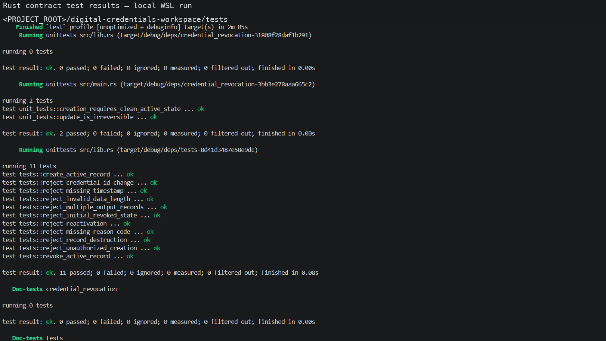
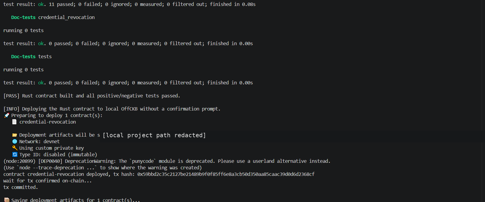
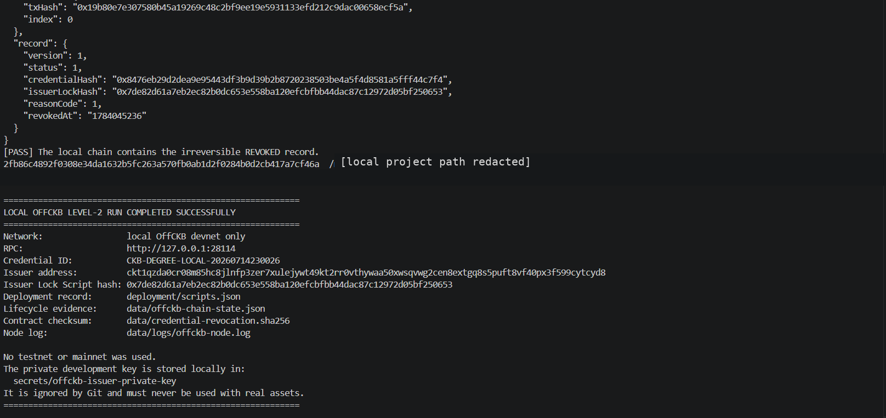

# CKB Degree Proof — CKBuilder Level 2

A complete local OffCKB application for issuing, verifying, and irreversibly revoking academic credentials.

The project satisfies the CKBuilder **“create your own basic application”** task at the advanced-extension level through:

- a Node.js credential application;
- privacy-conscious identity commitments;
- signed credential and revocation records;
- certificate-file tamper detection;
- a custom Rust CKB Type Script;
- positive and negative contract tests;
- automatic environment and toolchain checks;
- one-command local deployment and `ACTIVE → REVOKED` verification.

> **Network boundary:** the verified evidence in this repository uses only the local OffCKB devnet. No testnet or mainnet wallet or funds were used.

## Verified execution result

A complete run succeeded on **14 July 2026**.

| Check | Result |
|---|---:|
| Node.js tests | **11 passed, 0 failed** |
| Rust contract unit tests | **2 passed, 0 failed** |
| CKB `ckb-testtool` integration tests | **11 passed, 0 failed** |
| Contract deployment to local OffCKB | **Passed** |
| On-chain `ACTIVE` Cell creation | **Passed** |
| On-chain `ACTIVE → REVOKED` transition | **Passed** |
| Final indexer query | **`REVOKED` confirmed** |

### Local-chain evidence

| Item | Value |
|---|---|
| Credential ID | `CKB-DEGREE-LOCAL-20260714230026` |
| Contract deployment transaction | `0x59bbd2c35c2127be21489b9f0f85ff6e8a3cb50d350aa85caac39d0d6d2368cf` |
| ACTIVE record transaction | `0xf87a22dc73eba45646199263d52e8708f5de6c00d1b4bd6f546c867b36ea5637` |
| REVOKED record transaction | `0x19b80e7e307580b45a19269c48c2bf9ee19e5931133efd212c9dac00658ecf5a` |
| Issuer Lock Script hash | `0x7de82d61a7eb2ec82b0dc653e558ba120efcbfbb44dac87c12972d05bf250653` |
| Contract code hash | `0x61d275873bc434e8c84cd9556e6e13feb879b8be2878f16fa204575544ce50d0` |
| Contract binary SHA-256 | `2fb86c4892f0308e34da1632b5fc263a570fb0ab1d2f0284b0d2cb417a7cf46a` |

These transaction hashes belong to an ephemeral local blockchain and are not public explorer links.

## Screenshots

### Rust unit and integration tests



### Contract deployment to local OffCKB



### Final irreversible REVOKED state



The screenshots were reviewed for sensitive information and sanitized before inclusion. Local filesystem paths and the local Windows account identifier were redacted. No private-key value, seed phrase, password, API key, `.env` content, raw student ID, or identity salt appears in them. See [`screenshots/SECURITY_REVIEW.md`](screenshots/SECURITY_REVIEW.md).

The complete sanitized terminal log and a machine-readable run summary are available in [`evidence/`](evidence/).

## Application design

### Node.js application layer

The application supports:

1. issuer Ed25519 key initialization;
2. credential minting from degree data and a certificate file;
3. storage of a salted identity commitment instead of a raw student ID;
4. issuer signature verification;
5. certificate SHA-256 verification;
6. recipient-binding verification;
7. duplicate credential prevention;
8. signed revocation records;
9. generation of the exact 75-byte Cell data consumed by the Rust contract.

Expected application behavior:

| Scenario | Expected result |
|---|---|
| Original certificate | `VALID` |
| Modified certificate | `INVALID` — document hash mismatch |
| Untrusted issuer | `INVALID` |
| Tampered signed payload | `INVALID` |
| Revoked credential | `INVALID` |
| Duplicate credential ID | Rejected |
| Second revocation | Rejected |

### Rust on-chain policy layer

The Type Script in `digital-credentials-workspace/contracts/credential-revocation` enforces:

```text
creation:   no group input   -> one ACTIVE output
revocation: one ACTIVE input -> one REVOKED output
```

It rejects:

- unauthorized creation;
- creation directly in the revoked state;
- `REVOKED → ACTIVE` reactivation;
- credential ID changes;
- registry-record destruction;
- malformed Cell data;
- multiple output records;
- missing reason codes;
- missing revocation timestamps.

## One-command local run

### Requirements

- Linux, macOS, or WSL;
- Node.js 20 or newer;
- npm;
- Bash and curl;
- internet access during first installation;
- administrator permission to install missing Ubuntu/WSL packages.

On Ubuntu/WSL, the automation installs the required bare-metal RISC-V C toolchain:

```text
gcc-riscv64-unknown-elf
binutils-riscv64-unknown-elf
```

This toolchain is required because `ckb-std 0.17.2` builds a small C helper even though the application contract is written in Rust.

### Run

```bash
chmod +x scripts/*.sh
chmod +x digital-credentials-workspace/scripts/*
bash scripts/local-offckb-all.sh
```

The script automatically:

1. validates Node.js, npm, Rust, Cargo, Make, and the RISC-V toolchain;
2. installs missing prerequisites on Ubuntu/WSL;
3. forces the public npm registry for the run;
4. starts local OffCKB;
5. selects the first prefunded development account;
6. derives the issuer Lock Script hash with CCC;
7. creates or updates `.env` locally;
8. runs the Node.js tests and application demo;
9. formats, builds, and tests the Rust contract;
10. deploys the contract to local OffCKB;
11. creates an on-chain `ACTIVE` record;
12. consumes it into an on-chain `REVOKED` record;
13. queries the final live Cell and requires `REVOKED`;
14. records the binary checksum and local evidence.

To leave the OffCKB node running after completion:

```bash
KEEP_OFFCKB_NODE=1 bash scripts/local-offckb-all.sh
```

## Manual application commands

```bash
cp .env.example .env
npm install
npm run issuer:init
npm run ledger:reset
npm run credential:mint -- examples/degree-input.json examples/certificate-original.pdf
npm run credential:verify -- CKB-DEGREE-2026-0001 examples/certificate-original.pdf
npm run credential:revoke -- CKB-DEGREE-2026-0001 1 "Administrative correction"
npm run credential:verify -- CKB-DEGREE-2026-0001 examples/certificate-original.pdf
```

## Manual Rust commands

```bash
cd digital-credentials-workspace
make build
make test
```

The release binary is generated at:

```text
digital-credentials-workspace/build/release/credential-revocation
```

The CKB build uses:

```text
-C target-feature=+zba,+zbb,+zbc,+zbs
-C passes=lower-atomic
```

`lower-atomic` is required for the current Molecule/`bytes` dependency path on the CKB RISC-V target.

## Repository structure

```text
.
├── digital-credentials-workspace/  Rust Type Script and ckb-testtool tests
├── evidence/                       sanitized log and verified run summary
├── examples/                       deterministic credential fixtures
├── reports/                        weekly report template
├── screenshots/                    sanitized execution screenshots
├── scripts/                        environment, release, and automation scripts
├── src/                            Node.js application and CKB integration
└── test/                           Node.js positive and negative tests
```

## Security and privacy

- Raw student IDs and salts are not stored in credential records.
- Application-level issuer keys are generated under `secrets/` and ignored by Git.
- The OffCKB account private key is development-only, publicly known, and ignored by Git.
- Credential payloads and revocations are signed.
- Certificate bytes are checked with SHA-256.
- Revocation is one-way at contract level.
- The Type Script is bound to the issuer Lock Script hash.
- Negative tests prove that invalid transitions are rejected.

Run the release safety check before publishing:

```bash
bash scripts/audit-release.sh
```

Never publish or commit:

```text
.env
secrets/
data/ledger.json
data/trusted-issuers.json
```

Never send real assets to an OffCKB development account or reuse its key on testnet/mainnet.

## Documentation

- [`REQUIREMENTS_MATRIX.md`](REQUIREMENTS_MATRIX.md) maps the CKBuilder task to code and evidence.
- [`TEST_STATUS.md`](TEST_STATUS.md) records the verified test status.
- [`evidence/README.md`](evidence/README.md) describes the successful local execution.
- [`screenshots/SECURITY_REVIEW.md`](screenshots/SECURITY_REVIEW.md) documents the screenshot privacy review.
- [`reports/week-template.md`](reports/week-template.md) is the personal weekly-report template.

## Limitations

This is an educational reference implementation, not a production security audit. Production deployment would require institutional key management, issuer governance, operational monitoring, schema-version governance, independent smart-contract review, and a public-network deployment plan.
