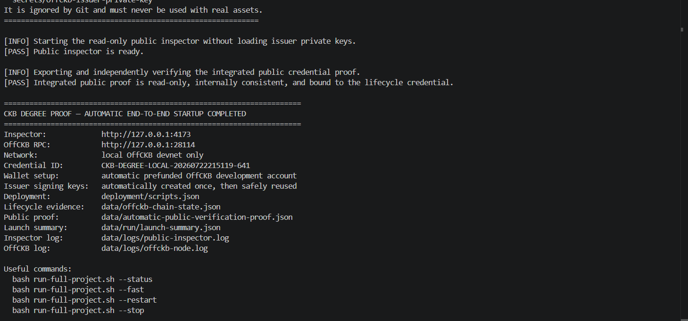
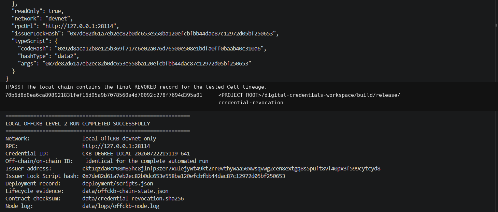
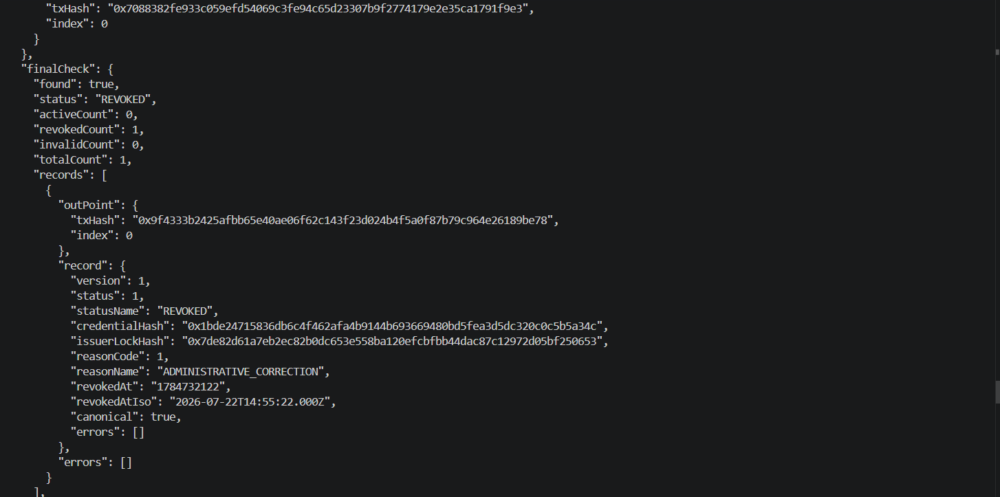

# CKBuilder Weekly Report — Week 2

**Reporting period:** 15–22 July 2026  
**Publication date:** 22 July 2026  
**Participant:** Dang Ba Ty  
**Project version:** CKB Degree Proof v2.1.2  
**Primary deliverable:** Public Credential Inspector and automatic end-to-end local workflow  
**Time spent:** Not formally recorded; future reports will record this consistently.

## Summary

During Week 2, I extended the Week 1 credential prototype into a public, read-only verification tool and a reproducible community reference package. The final workflow now checks the existing environment, installs only missing prerequisites, selects a prefunded local OffCKB development account, creates or reuses local issuer keys, builds and tests the Rust contract, deploys it, completes a single-credential `ACTIVE → REVOKED` lifecycle, exports an independently verifiable proof, and starts the browser inspector with one command:

```bash
bash run-full-project.sh
```

The final run completed successfully on the local OffCKB devnet. The inspector became ready at `http://127.0.0.1:4173`, and the exported public proof confirmed that the off-chain and on-chain states were consistently `REVOKED` without requiring an issuer private key.

## Handbook learning and completion record

| Learning or practical activity | Result | Evidence |
|---|---:|---|
| Reuse and validation of the CKB developer environment | Passed | [`../screenshots/04-automatic-end-to-end-success.png`](../screenshots/04-automatic-end-to-end-success.png) |
| CCC-based local CKB account and Script configuration | Passed | [`../evidence/week-02-run-summary.json`](../evidence/week-02-run-summary.json) |
| Rust Type Script build and unit testing | 5 passed, 0 failed | [`../evidence/automatic-end-to-end-run-2026-07-22-sanitized.log`](../evidence/automatic-end-to-end-run-2026-07-22-sanitized.log) |
| `ckb-testtool` contract integration testing | 18 passed, 0 failed | [`../evidence/automatic-end-to-end-run-2026-07-22-sanitized.log`](../evidence/automatic-end-to-end-run-2026-07-22-sanitized.log) |
| Node.js, API, security, proof, and launcher tests | 74 passed, 0 failed | [`../evidence/automatic-end-to-end-run-2026-07-22-sanitized.log`](../evidence/automatic-end-to-end-run-2026-07-22-sanitized.log) |
| Local contract deployment | Completed | [`../screenshots/05-local-offckb-lifecycle-success.png`](../screenshots/05-local-offckb-lifecycle-success.png) |
| On-chain `ACTIVE → REVOKED` lifecycle | Completed | [`../screenshots/06-final-revoked-cell.png`](../screenshots/06-final-revoked-cell.png) |
| Read-only public proof export and verification | Passed | [`../data/automatic-public-verification-proof.json`](../data/automatic-public-verification-proof.json) |

No separate scored CKB Academy module was recorded during this reporting period, so this report does not claim an Academy score. The work documented here is practical CKBuilder capstone and developer-tool learning. Academy and CCC Playground progress remain tracked separately in [`../HANDBOOK_PROGRESS.md`](../HANDBOOK_PROGRESS.md).

## Work completed

### 1. Public Credential Inspector

I added a public inspection path that can:

- inspect a credential without loading an issuer private key;
- verify the trusted issuer and credential signature;
- compare an uploaded certificate with the signed SHA-256 document hash;
- query the current live credential Cell through CKB RPC;
- distinguish `ACTIVE`, `REVOKED`, `NOT_FOUND`, malformed, and duplicate/conflicting states;
- compare off-chain and on-chain status;
- display saved transaction history;
- export a machine-readable verification proof.

### 2. Community interoperability contribution

I added reusable material that can be tested independently of the application UI:

- a documented 75-byte credential Cell-data format;
- a dependency-free JavaScript decoder;
- deterministic valid and invalid conformance vectors;
- JSON schemas for Cell vectors and public proofs;
- an independent proof verifier;
- a deployment-specific decoder manifest exporter;
- HTTP endpoints for Cell decoding and proof verification.

This gives explorers, educational tools, and other CKB developers concrete fixtures for implementing and checking compatible decoders.

### 3. Automatic end-to-end setup

The new launcher performs the complete local workflow without manual wallet setup. It:

1. checks existing Node.js, npm, Rust, Cargo, Make, and RISC-V tools;
2. installs only missing prerequisites;
3. starts or reuses local OffCKB;
4. selects a prefunded local development account;
5. creates or reuses issuer signing keys;
6. runs the Node.js test suite;
7. builds and tests the Rust contract;
8. deploys the contract;
9. uses one credential ID in both the off-chain and on-chain workflow;
10. creates an `ACTIVE` Cell and consumes it into a `REVOKED` Cell;
11. exports and verifies the public proof;
12. starts the read-only inspector.

### 4. Correctness and security improvements

I also corrected or strengthened:

- invalid timestamp handling so failed revocation does not partially modify the ledger;
- binding of revocation events to the correct credential and issuer;
- read-only inspection so it does not require a signer;
- duplicate/conflicting Cell detection;
- API content-type, base64, body-size, and path-traversal validation;
- output Lock Script enforcement in the Rust contract;
- inspector health checking, including pretty-printed JSON responses;
- Git-ignore rules for runtime keys, local configuration, logs, and process files.

## Verified end-to-end result

| Item | Result |
|---|---|
| Network | Local OffCKB devnet only |
| Credential ID | `CKB-DEGREE-LOCAL-20260722215119-641` |
| Contract deployment transaction | `0x6c4be1ad765bf73df3ea12158e1843a0ed4090bedc5170d03647a09a335b97c4` |
| `ACTIVE` transaction | `0x7088382fe933c059efd54069c3fe94c65d23307b9f2774179e2e35ca1791f9e3` |
| `REVOKED` transaction | `0x9f4333b2425afbb65e40ae06f62c143f23d024b4f5a0f87b79c964e26189be78` |
| Final active records | `0` |
| Final revoked records | `1` |
| Final invalid records | `0` |
| Contract code hash | `0x92d8aca12b8e125b369f717c6e02a076d76500e508e1bdfa0ff0baab40c310a6` |
| Contract binary SHA-256 | `70b6d8d0ea6ca898921831fef16d95a9b7078560a4d70092c278f7694d395a01` |
| Public proof outcome | `REVOKED` |
| Public proof digest | `0xdfccadca6a43a5e6d39d24501ff842121bb0e6551585780f178be71e98fe717e` |
| Private key required for inspection | No |

These transaction hashes are local-devnet evidence and are not public explorer links.

## Screenshots

### Automatic startup and public proof completion



### Contract deployment and local lifecycle completion



### Final canonical `REVOKED` Cell



## Problems encountered and how I verified the fixes

### Inspector readiness false failure

The inspector was running, but the launcher originally searched only for compact JSON containing `"ok":true`. The health endpoint returned pretty-printed JSON containing `"ok": true`, causing a false failure. I replaced the brittle text match with a reusable health check and added regression tests for both JSON formats.

### Build and dependency setup

The first complete run required downloading npm and Cargo dependencies and compiling the CKB contract for RISC-V. The launcher now checks what is already present and reuses compatible tools on later runs.

### Maintaining a safe public package

Runtime private keys and `.env` configuration are generated locally and ignored by Git. The public repository contains `.env.example`, sanitized logs, public hashes, and local-devnet transaction evidence, but not the generated issuer private keys.

## What I learned

- A read-only blockchain verifier should be architecturally separate from the component that signs transactions.
- In CKB, revocation is represented by consuming the live `ACTIVE` Cell and creating a new `REVOKED` Cell under the same protected Type Script.
- A signed revocation event is not sufficient unless it is also bound to the same credential and issuer being checked.
- Test vectors and an independent decoder make a project more useful to the community than an application-specific UI alone.
- Health checks should parse meaning rather than depend on insignificant JSON whitespace.
- Per-Cell irreversibility is different from global uniqueness. The present contract protects one Cell lineage, while duplicate independent lineages remain a documented protocol limitation.

## Community value and feedback requested

The contribution is intended to help new CKB developers understand stateful Cells and to give other tools a reproducible credential-data fixture. The most useful feedback would be:

- whether the 75-byte Cell-data format is clear enough to implement in another language;
- whether the decoder manifest is suitable for explorer integration;
- how global credential uniqueness should be handled without making the beginner capstone unnecessarily complex;
- which additional malformed Cell vectors would be valuable.

## Evidence index

- [Machine-readable Week 2 run summary](../evidence/week-02-run-summary.json)
- [Sanitized complete terminal log](../evidence/automatic-end-to-end-run-2026-07-22-sanitized.log)
- [Latest live chain state](../data/offckb-chain-state.json)
- [Integrated public verification proof](../data/automatic-public-verification-proof.json)
- [Deployment metadata](../deployment/scripts.json)
- [Screenshot security review](../screenshots/SECURITY_REVIEW.md)

## Next week

- Complete and record the relevant CKB Academy and CCC Playground exercises separately from capstone engineering.
- Publish a focused community post with the decoder specification and reproducible transaction fixture.
- Request feedback before proposing integration with a third-party transaction visualizer.
- Investigate a protocol-level uniqueness design while preserving a small, understandable learning project.
